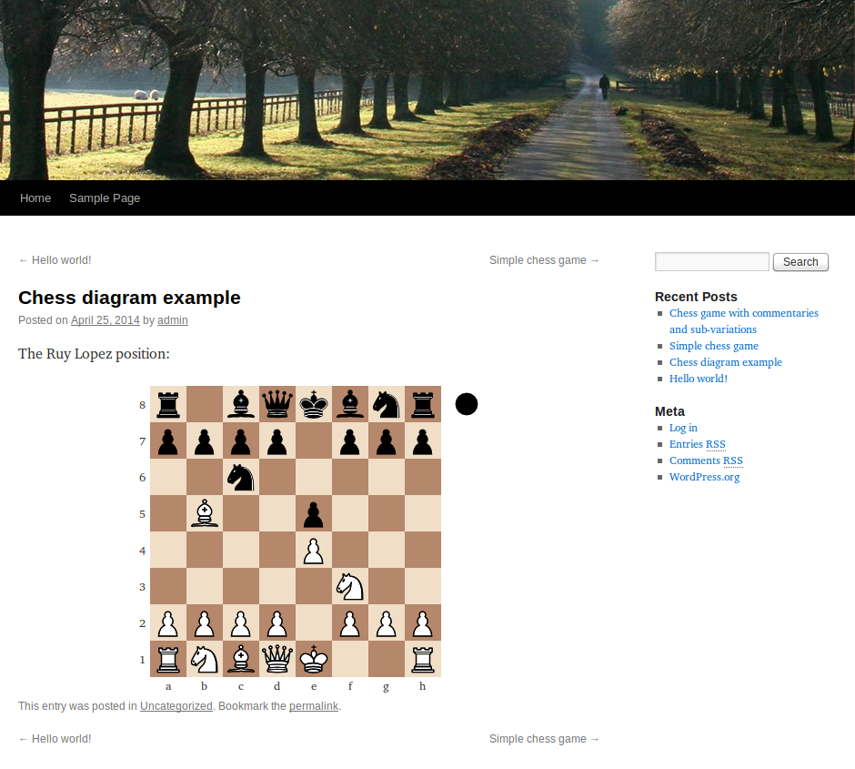
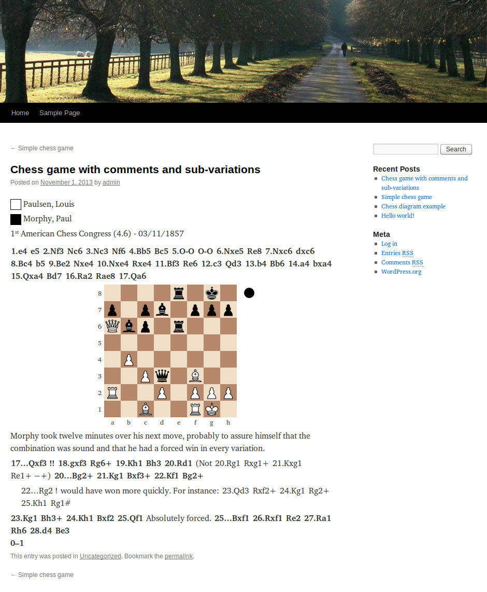

RPB Chessboard
==============


Presentation
------------

RPB Chessboard is a plugin for the [Wordpress](http://wordpress.org/) website
and blog CMS (_content management system_).
This plugin allows you to typeset and display chess games and diagrams
in the posts and pages of your Wordpress website,
using the standard [FEN](http://en.wikipedia.org/wiki/Forsyth-Edwards_Notation)
and [PGN](http://en.wikipedia.org/wiki/Portable_Game_Notation) notations.

http://wordpress.org/plugins/rpb-chessboard/  
https://github.com/yo35/rpb-chessboard (developer link)


Features
--------

* Customizable aspect for the chessboards (orientation, size, etc...).
* Support commentaries and sub-variations in PGN-encoded games.
* Support HTML formatting in PGN commentaries.
* Compatibility mode to avoid conflicts with the other plugins that also use
  the `[fen][/fen]` and `[pgn][/pgn]` shortcodes.

RPB Chessboard uses the [chess.js](https://github.com/jhlywa/chess.js) javascript
library for FEN (and to some extent PGN) parsing.


Examples & Screenshots
----------------------

### Chess diagram ###

```
[fen]r1bqkbnr/pppp1ppp/2n5/1B2p3/4P3/5N2/PPPP1PPP/RNBQK2R b KQkq - 3 3[/fen]
```




### Chess game with commentaries and sub-variations ###

```
[pgn]

[Event "1<sup>st</sup> American Chess Congress"]
[Site "New York, NY USA"]
[Date "1857.11.03"]
[Round "4.6"]
[White "Paulsen, Louis"]
[Black "Morphy, Paul"]
[Result "0-1"]

1. e4 e5 2. Nf3 Nc6 3. Nc3 Nf6 4. Bb5 Bc5 5. O-O O-O 6. Nxe5 Re8 7. Nxc6 dxc6 8. Bc4 b5 9. Be2 Nxe4
10. Nxe4 Rxe4 11. Bf3 Re6 12. c3 Qd3 13. b4 Bb6 14. a4 bxa4 15. Qxa4 Bd7 16. Ra2 Rae8 17. Qa6

{[pgndiagram] Morphy took twelve minutes over his next move, probably to assure himself that the
combination was sound and that he had a forced win in every variation.}

17... Qxf3 $3 18. gxf3 Rg6+ 19. Kh1 Bh3 20. Rd1 ({Not} 20. Rg1 Rxg1+ 21. Kxg1 Re1+ $19)
20... Bg2+ 21. Kg1 Bxf3+ 22. Kf1 Bg2+

(22...Rg2 $1 {would have won more quickly. For instance:} 23. Qd3 Rxf2+ 24. Kg1 Rg2+ 25. Kh1 Rg1#)

23. Kg1 Bh3+ 24. Kh1 Bxf2 25. Qf1 {Absolutely forced.} 25... Bxf1 26. Rxf1 Re2 27. Ra1 Rh6
28. d4 Be3 0-1

[/pgn]
```


