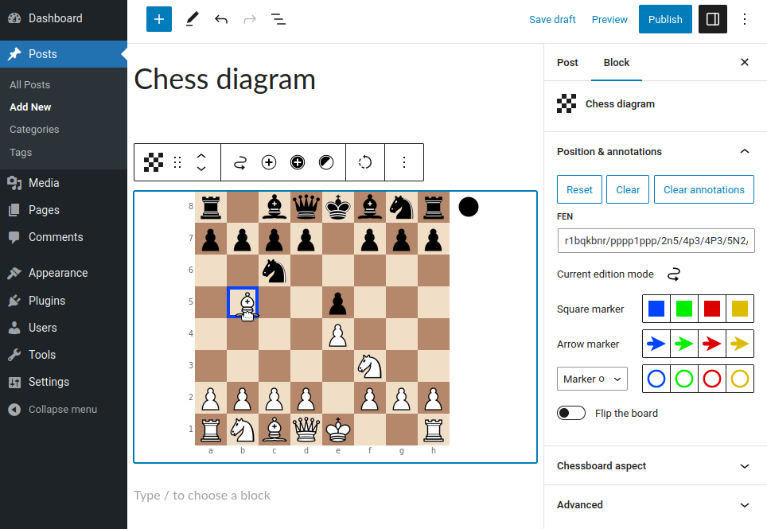

RPB Chessboard
==============

RPB Chessboard is a plugin for [WordPress](http://wordpress.org/),
the popular blog [CMS](http://en.wikipedia.org/wiki/Content_management_system).
It allows to typeset and display chess games and diagrams on posts and pages of WordPress blogs,
using the standard [FEN](http://en.wikipedia.org/wiki/Forsyth-Edwards_Notation)
and [PGN](http://en.wikipedia.org/wiki/Portable_Game_Notation) notations.

https://wordpress.org/plugins/rpb-chessboard/


Live demo
---------

https://rpb-chessboard.yo35.org/


Features
--------

* Customizable aspect for the chessboards (orientation, size, etc...).
* Support comments and sub-variations in PGN-encoded games.
* Support HTML formatting in PGN comments.
* Colored square and arrow markers.
* Compatibility mode to avoid conflicts with the other plugins that use
  the `[fen][/fen]` and `[pgn][/pgn]` shortcodes too.
* Upload PGN files and load PGN data from a URL.
* Graphical assistant to create and modify chess diagrams in the post/page editor.
* Multi-language support.

If you encounter some bugs with this program, or if you wish to get new features
in the future versions, you can report/propose them
in the [GitHub bug tracker](https://github.com/yo35/rpb-chessboard/issues).

If you are interested in translating this plugin into your language,
please [contact the author](mailto:yo35@melix.net).


Examples & Screenshots
----------------------

### Chess diagram ###

```
[fen]r1bqkbnr/pppp1ppp/2n5/1B2p3/4P3/5N2/PPPP1PPP/RNBQK2R b KQkq - 3 3[/fen]
```


### Chess game with comments and sub-variations ###

```
[pgn]

[Event "1<sup>st</sup> American Chess Congress"]
[Site "New York, NY USA"]
[Date "1857.11.03"]
[Round "4.6"]
[White "Paulsen, Louis"]
[Black "Morphy, Paul"]
[Result "0-1"]

1.e4 e5 2.Nf3 Nc6 3.Nc3 Nf6 4.Bb5 Bc5 5.O-O O-O 6.Nxe5 Re8 7.Nxc6 dxc6 8.Bc4 b5
9.Be2 Nxe4 10.Nxe4 Rxe4 11.Bf3 Re6 12.c3 Qd3 13.b4 Bb6 14.a4 bxa4 15.Qxa4 Bd7
16.Ra2 Rae8 17.Qa6

{[pgndiagram][%csl Yf3][%cal Rd3f3,Re6g6,Gg6g1] Morphy took twelve minutes
over his next move, probably to assure himself that the combination was sound
and that he had a forced win in every variation.}

17...Qxf3 !! 18.gxf3 Rg6+ 19.Kh1 Bh3 20.Rd1 ({Not} 20.Rg1 Rxg1+ 21.Kxg1 Re1+ -+)
20...Bg2+ 21.Kg1 Bxf3+ 22.Kf1 Bg2+

(22...Rg2 ! {would have won more quickly. For instance:} 23.Qd3 Rxf2+
24.Kg1 Rg2+ 25.Kh1 Rg1#)

23.Kg1 Bh3+ 24.Kh1 Bxf2 25.Qf1 {Absolutely forced.} 25...Bxf1 26.Rxf1 Re2
27.Ra1 Rh6 28.d4 Be3 0-1

[/pgn]
```




### Graphical assistant for chess diagrams creation/modification ###


