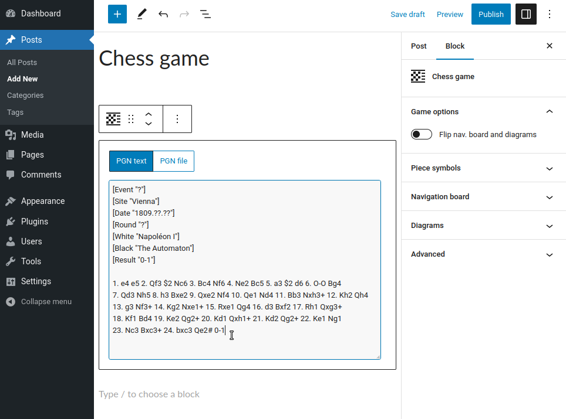

RPB Chessboard
==============

RPB Chessboard is a plugin for [WordPress](https://wordpress.org/),
the popular blog [CMS](https://en.wikipedia.org/wiki/Content_management_system).
It allows to typeset and display chess games and diagrams in posts and pages of WordPress blogs,
using the standard [FEN](https://en.wikipedia.org/wiki/Forsyth-Edwards_Notation)
and [PGN](https://en.wikipedia.org/wiki/Portable_Game_Notation) notations.

https://wordpress.org/plugins/rpb-chessboard/

Documentation & examples
------------------------

https://rpb-chessboard.yo35.org/

Features
--------

* Customizable aspect for the chessboards (orientation, size, etc...).
* Support comments and sub-variations in PGN-encoded games.
* Support HTML formatting in PGN comments.
* Support several chess variants:
  - [Chess960](https://en.wikipedia.org/wiki/Chess960) (also known as Fischer Random Chess).
  - [Antichess](https://en.wikipedia.org/wiki/Losing_chess).
  - [Horde chess](https://en.wikipedia.org/wiki/Dunsany%27s_chess#Horde_chess).
* Colored square and arrow markers.
* Integration with the Gutenberg post/page editor.
* Multi-language support.

If you encounter some bugs with this program, or if you wish to get new features
in the future versions, you can report/propose them
in the [GitHub bug tracker](https://github.com/yo35/rpb-chessboard/issues).

If you are interested in translating this plugin into your language,
please [contact the author](mailto:yo35@melix.net).

Custom developments in relation with RPB Chessboard (e.g. specific feature, advanced customization...)
can be realized by the author as a paid service. If you need to have such custom developments for your website,
please feel free to [contact the author](mailto:yo35@melix.net).

Screenshots
-----------

### Chess diagram in a post ###

### Chess game in a post ###

### Chess diagram block in the Gutenberg post/page editor ###

### Chess game block in the Gutenberg post/page editor ###

